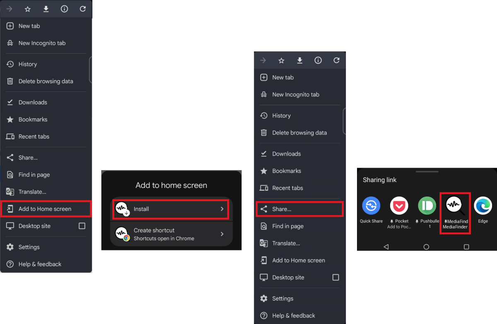

# MP3 Finder

MP3 Finder is a Progressive Web Application (PWA) designed to assist users in locating MP3 links on websites.

The application can be installed on mobile devices, enabling users to use it as a "Share" target for seamless integration and functionality.

